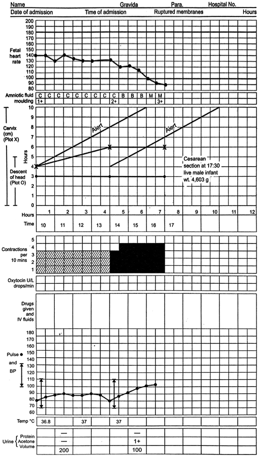

# scaleme.js

A tiny, dependency-free charting library. The whole thing is three engines:

1. **Data** — normalize input into `{ x, y }` points
2. **Scale** — convert data values into pixel positions
3. **Renderer** — draw to Canvas (SVG-swappable behind the `Renderer` interface)

Ships ESM + CJS + types.

## Origins

I first built this **~3 years ago for Afyacare**, as a module
on top of **[Bahmni](https://www.bahmni.org/)** (the open-source hospital system) using
the **AngularJS** framework. Its original job was to render a **partograph** — the WHO
labour-monitoring chart used on maternity wards.

This version is a **ground-up rewrite in modern TypeScript**: a clean scale/renderer
engine split, high-DPI canvas, strict typing, and a proper build. The partograph came
along for the ride — it's now a first-class export (`createPartograph`) built entirely on
the same core engines.

## Install

```bash
npm install scaleme.js
```

## Usage

```ts
import { createChart } from "scaleme.js";

createChart({
  type: "line", // or "bar"
  element: "#app", // CSS selector, container, or <canvas>
  data: [
    { x: 1, y: 10 },
    { x: 2, y: 20 },
    { x: 3, y: 15 },
  ],
});
```

Pass a container `<div>` and scaleme creates a responsive canvas inside it;
pass a `<canvas>` directly and it draws into that.

### Options

| Option        | Default        | Description                            |
| ------------- | -------------- | -------------------------------------- |
| `color`       | per chart type | Series color                           |
| `axes`        | `true`         | Draw axis lines + tick labels          |
| `grid`        | `true`         | Draw horizontal grid lines             |
| `background`  | transparent    | Plot-area background fill              |
| `padding`     | auto           | `{ top, right, bottom, left }` in px   |
| **line**      |                |                                        |
| `points`      | `true`         | Draw a dot at each point               |
| `pointRadius` | `3`            | Dot radius (px)                        |
| `lineWidth`   | `2`            | Stroke width (px)                      |
| `smooth`      | `false`        | Smooth (curved) line                   |
| `area`        | `false`        | Fill the area under the line           |
| `areaColor`   | color @ 15%    | Explicit area fill color               |
| **bar**       |                |                                        |
| `barRadius`   | `2`            | Corner radius (px)                     |
| `barPadding`  | `0.6`          | Bar width as fraction of slot (0–1)    |

Full reference with copy-paste recipes lives in **[demo/docs.html](demo/docs.html)**
(`npm run dev`, then open `/docs.html`).

### Handle

`createChart` returns a handle for live updates:

```ts
const chart = createChart({ type: "line", element: "#app", data });

chart.update(newData); // swap data + repaint
chart.render(); // repaint (also auto-fires on window resize)
chart.destroy(); // remove listeners
```

## Partograph

The chart scaleme.js was born to draw. A partograph stacks several clinical panels
(fetal heart rate, cervical dilatation, contractions, pulse/BP…) on one shared time
axis; the centerpiece is the **cervicograph** with its **Alert** and **Action** lines.

```ts
import { createPartograph } from "scaleme.js";

createPartograph({
  element: "#partograph",
  hours: 12,
  alertLineStartHour: 0,
  patient: { name: "A. Mother", gravida: "2", para: "1" },
  fetalHeartRate: [{ hour: 0, value: 140 }, { hour: 1, value: 136 } /* … */],
  cervix: [{ hour: 0, value: 4 }, { hour: 4, value: 6 }], // plotted ✕
  descent: [{ hour: 0, value: 4 }, { hour: 4, value: 3 }], // plotted ◯
  contractions: [{ hour: 4, count: 4, intensity: "strong" } /* … */],
  amnioticFluid: [{ hour: 0, value: "C" }],
  moulding: [{ hour: 0, value: "+" }],
  pulse: [{ hour: 0, value: 80 }],
  bloodPressure: [{ hour: 0, systolic: 120, diastolic: 80 }],
  temperature: [{ hour: 0, value: 36.8 }],
});
```

Run `npm run dev` and open **[demo/partograph.html](demo/partograph.html)** to see it live.

The layout follows the standard WHO partograph:



## Architecture

```
src/
├── core/
│   ├── chart.ts      # createChart orchestrator: data → scales → render
│   ├── renderer.ts   # Canvas drawing primitives (the SVG seam)
│   ├── scale.ts      # linear scale: value → pixel, + inverse + ticks
│   ├── axes.ts       # axis lines, grid, tick labels
│   └── types.ts      # shared public/internal types
├── charts/
│   ├── line.ts       # line series drawer
│   └── bar.ts        # bar series drawer
├── partograph/
│   ├── partograph.ts # createPartograph: stacked clinical panels on a time axis
│   └── types.ts      # partograph data model
├── utils/
│   ├── math.ts       # extent, niceTicks, formatTick
│   └── dom.ts        # element resolution, high-DPI canvas setup
└── index.ts          # public API
```

## Develop

```bash
npm run dev        # live demo at demo/index.html
npm run build      # bundle to dist/
npm run typecheck  # tsc --noEmit
```

## Roadmap

- [x] Line + bar charts, linear scales, axes, grid, high-DPI
- [x] Partograph (`createPartograph`) — the original AngularJS module, reborn in TS
- [ ] Hover tooltip (the `Scale.invert` hook is already in place for hit-testing)
- [ ] Multiple datasets / legends
- [ ] Zoom & pan, animations
- [ ] SVG renderer, log scales
- [ ] React / Angular wrappers

## License

MIT
